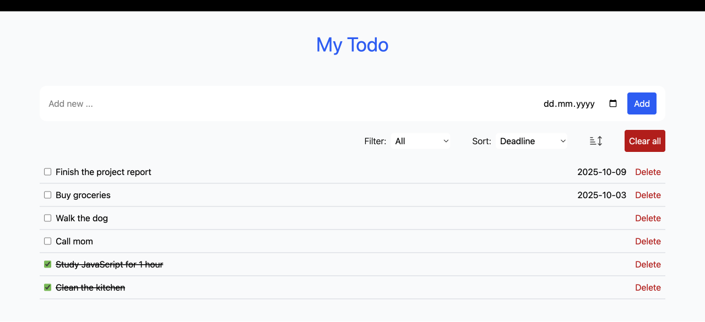

# My ToDo App

Simple task manager built with React + Vite



## Installation

```bash
git clone https://github.com/li-kravt/todo-react-sep25.git
cd todo-react-sep25
npm install
npm run dev 
```

## Usage
- Type a task in the input field and click the "Add" button
- Mark task as done or delete them
- Tasks are saved in localStorage, so they stay after refresh
- Sort and filter tasks as you like

## Features
- Save tasks in LocalStorage
- Add new tasks
- Mark tasks as completed
- Set deadline for tasks
- Delete tasks individually
- Sort and filter tasks
- Delete all tasks

## License
MIT